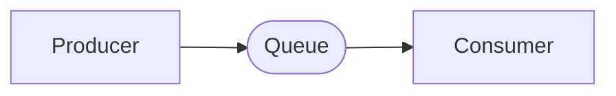

# mq-connector

A small library for message brokers in DL projects.

## Key concepts

### Consumer And Producer

**Producer** - is an simple interface for publishing messages to queue.
Every **producer** is stiked to queue for which it was created, so you have
a **producer** for each proccessed queue.

**Consumer** - is long running proccess, that somehow handles every received
message from **producer**. 
 

### Subscriber and Publisher

**Publisher** - is the the special case of **producer**, that publishes a message
not to a single queue, but to an _**subscription**_ (exchange or some kind of a router)
that will copy message to all subscribed (listening) queues.

**Subscriber** - is the special case of **consumer**, that receives messages from not
a specific queue but rather exchange or router that it subscribed to.
